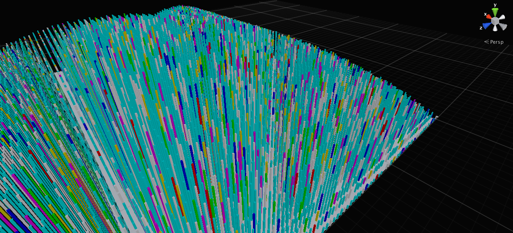
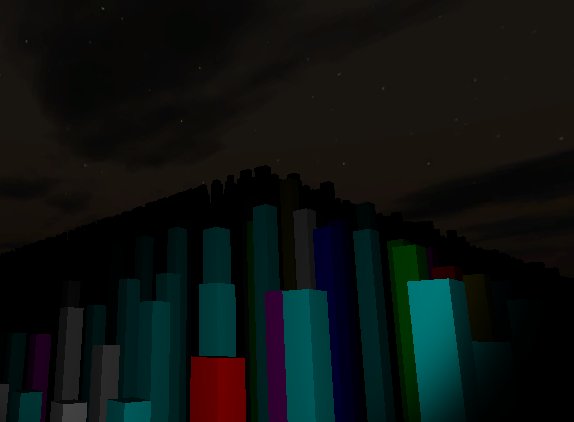
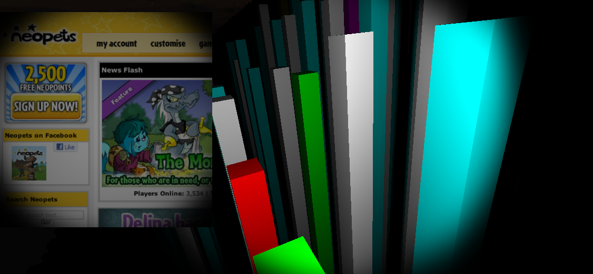

# cyber-space

Welcome to the Cyber Space. You will be riding on a spaceship and there is a territory which is occupied by an enormous amount of buildings. Each building represents a website, and they are the top 10,000 websites around the world. The height of the buildings are sorted by their popularities, and the color of the buildings are sorted by TLD's. Once you hit a building, there will be a screen shot of that website loaded on your upper left corner. Enjoy the experience! (More features are in development)

Technologies: Python Server, C# in Unity, Phantomjs

